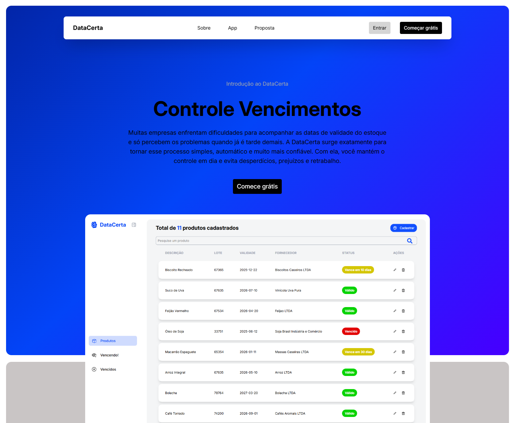
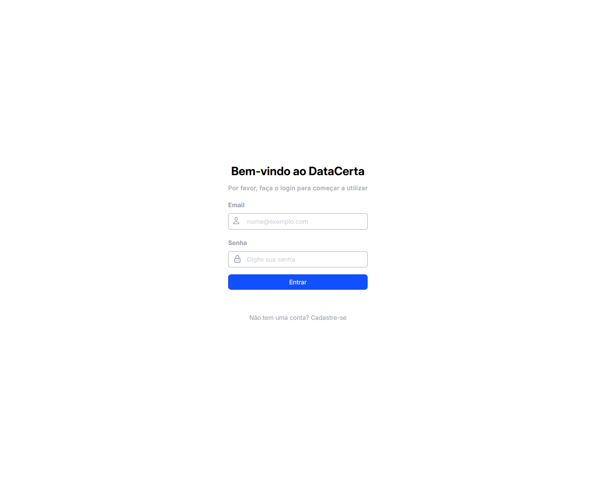
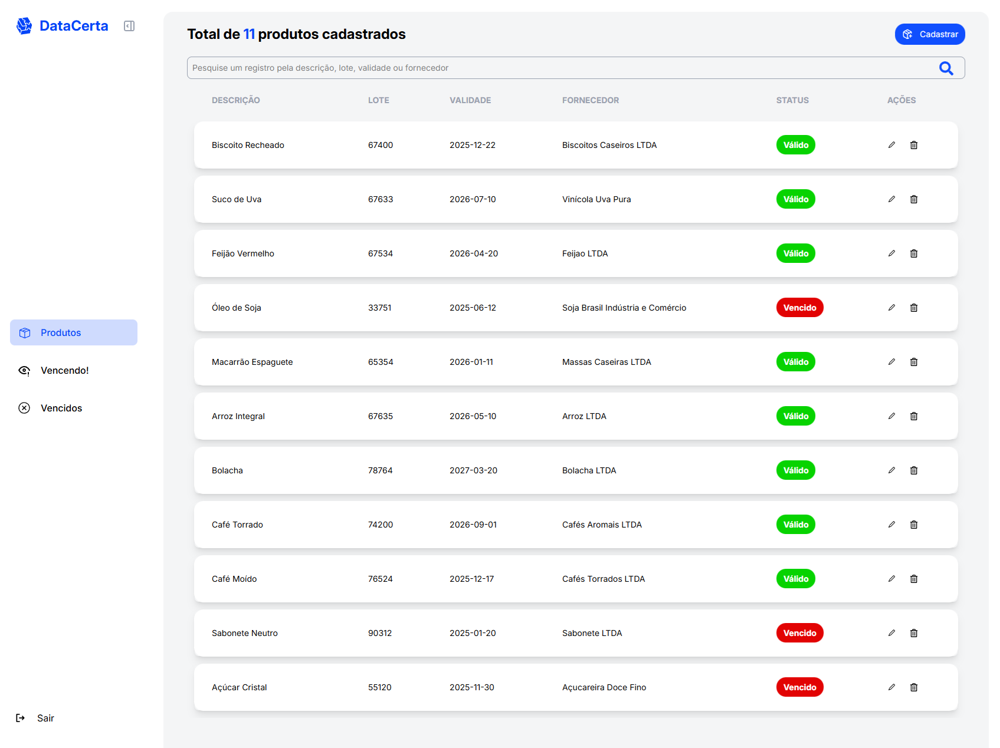
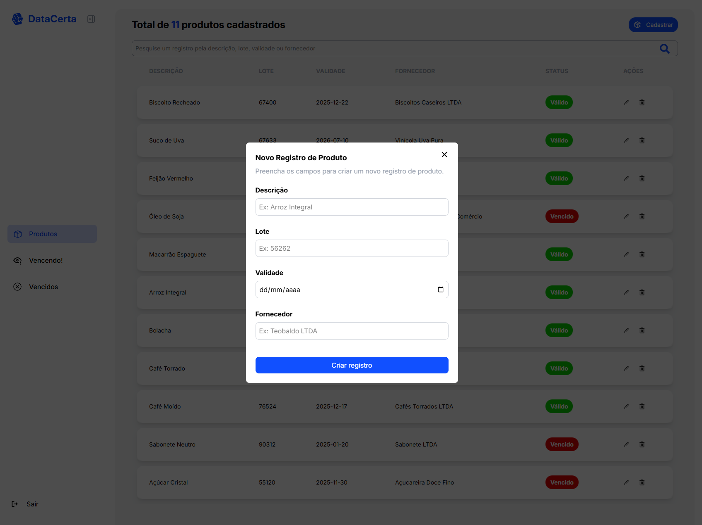

# 📦 DataCerta – Controle de Vencimentos de Produtos


Sistema web para **gerenciamento e controle de validade de produtos**, permitindo que usuários acompanhem prazos de vencimento, evitem perdas e mantenham a organização de seus registros de forma simples e eficiente.

---

## 🚀 Visão Geral

Este projeto foi desenvolvido com foco em **controle de vencimentos**, oferecendo uma experiência completa desde o cadastro do usuário até a visualização inteligente do status de cada produto com base na data atual.

O sistema conta com **autenticação**, **área administrativa**, **filtros inteligentes**, **status automáticos de validade** e uma **landing page institucional** explicando o funcionamento do produto.

---

## 🖼️ Demonstração

### Login


### Cadastro (Signup)


### Área Administrativa


### Cadastro de Produto


### Produtos Vencendo


### Produtos Vencidos


---

## 🧩 Funcionalidades

### 🔐 Autenticação

* Criação de conta (signup)
* Login seguro
* Logout disponível pela sidebar

### 🏠 Área Administrativa

Após o login, o usuário tem acesso a uma área administrativa onde pode gerenciar todos os produtos cadastrados.

### ➕ Cadastro de Produtos

* Cadastro via modal
* Campos disponíveis:

  * Descrição
  * Lote
  * Data de validade
  * Fornecedor

### 🗂️ Gerenciamento de Produtos

* Listagem de todos os produtos na seção **"Produtos"**
* Ações disponíveis:

  * Editar registros
  * Excluir registros
  * Pesquisar por:

    * Descrição
    * Lote
    * Validade
    * Fornecedor

### ⏱️ Controle Inteligente de Validade

O sistema gera automaticamente um **card de status** para cada produto, com base na data atual e na data de validade cadastrada:

* ✅ Válido
* ⚠️ Vencendo em:

  * 5 dias
  * 10 dias
  * 15 dias
  * 20 dias
  * 25 dias
  * 30 dias
* ❌ Vencido

### 📊 Seções Dinâmicas

A navegação é feita através de uma **sidebar lateral**, permitindo acesso rápido às seções:

* **Produtos** → Todos os registros
* **Vencendo** → Apenas produtos que vencem em 5, 10, 15, 20, 25 ou 30 dias
* **Vencidos** → Produtos já vencidos

Em todas as seções, o usuário pode:

* Editar registros
* Excluir registros
* Pesquisar produtos

### 🌐 Landing Page

* Página institucional apresentando o produto
* Explicação clara de como o sistema funciona
* Botões de redirecionamento para **Login** e **Cadastro**

---

## 🛠️ Tecnologias Utilizadas

Este projeto foi desenvolvido utilizando tecnologias modernas do ecossistema frontend e backend serverless:

* **Frontend:** React.js
* **Linguagem:** TypeScript
* **Estilização:** Tailwind CSS
* **Backend / Serviços:** Firebase

  * Firebase Authentication
  * Firestore Database

---

## 📁 Estrutura do Projeto

A estrutura foi organizada seguindo boas práticas de aplicações React com TypeScript:

```
data-certa-app/
├── src/
│   ├── assets/            # Arquivos estáticos
│   ├── components/        # Componentes reutilizáveis
│   │   ├── HeaderHome
│   │   ├── ModalRegister
│   │   ├── ModalUpdate
│   │   ├── PrivateRoute
│   │   └── Sidebar
│   ├── contexts/          # Context API (auth e estados globais)
│   ├── layout/            # Layouts da aplicação
│   ├── pages/             # Páginas principais
│   │   ├── Admin
│   │   ├── ExpiredProducts
│   │   ├── ExpiringProducts
│   │   ├── Home
│   │   ├── Login
│   │   ├── Signup
│   │   └── NotFound
│   ├── TableProducts/     # Tabela e lógica dos produtos
│   ├── services/          # Integrações com Firebase
│   ├── App.tsx
│   ├── main.tsx
│   └── index.css
├── public/
├── .env
├── package.json
├── vite.config.ts
└── README.md
```

---

## ▶️ Como Executar o Projeto

### 📋 Pré-requisitos

* Node.js (versão 18 ou superior)
* NPM ou Yarn

### 🔧 Configuração do ambiente

Este projeto utiliza o **Firebase**, portanto é necessário configurar as variáveis de ambiente.

Crie um arquivo **`.env`** na raiz do projeto e adicione as seguintes variáveis:

```env
VITE_FIREBASE_API_KEY=
VITE_FIREBASE_AUTH_DOMAIN=
VITE_FIREBASE_PROJECT_ID=
VITE_FIREBASE_STORAGE_BUCKET=
VITE_FIREBASE_MESSAGING_SENDER_ID=
VITE_FIREBASE_APP_ID=
```

> ⚠️ As credenciais podem ser obtidas no console do Firebase ao criar um novo projeto.

### ▶️ Executando a aplicação

```bash
# Clone o repositório
git clone https://github.com/rogeranacleto/data-certa-app.git

# Acesse a pasta do projeto
cd data-certa-app

# Instale as dependências
npm install

# Inicie a aplicação
npm run dev
```

---

## 🎯 Objetivo do Projeto

O **DataCerta** foi desenvolvido com o objetivo de oferecer uma solução prática e acessível para o controle de vencimento de produtos, sendo especialmente aplicável a pequenos negócios e microempreendedores que precisam organizar estoques e evitar perdas por produtos vencidos.

Além do aspecto funcional, o projeto também teve como propósito consolidar conhecimentos em desenvolvimento frontend, aplicando boas práticas de organização de código, tipagem com TypeScript e integração com serviços em nuvem, simulando um cenário real de aplicação em produção.